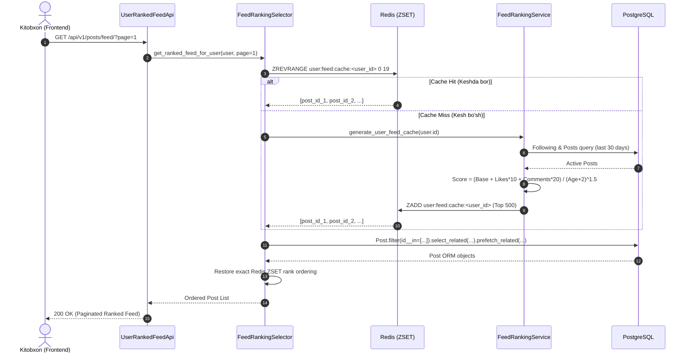

# OKJ Platform - Feed Ranking Moduli Arxitekturasi (architecture.md)

Bu hujjat **Feed Ranking** (Ijtimoiy lentani algoritmik saralash va gibrid Feed mexanizmi) modulining dizayn qarorlari, matematiki formulalari, kesh strategiyasi va ma'lumotlar oqimini batafsil tushuntiradi.

---

## 1. Modulning Maqsadi va O'rnati

`feed_ranking` moduli **OKJ (O'zbekiston Kitobxonlari Jamiyati)** platformasidagi kitobxonlar uchun faqat o'zlari ergashgan (Following) foydalanuvchilar va platformadagi eng sara postlardan iborat algoritmik saralangan lenta (`Home Feed`) yaratib beradi.
Bu modul mavjud `posts`, `follows`, `interactions` va `comments` modullari ustida qatlam sifatida ishlaydi, biroq ularning jadvallarini yoki ichki kodlarini o'zgartirmaydi (**HackSoft Django Styleguide - Loose Coupling**).

---

## 2. Time-Decay Reyting Algoritmi (Post Score Algorithm)

Har bir postning lentadagi o'rni algoritmik hisob-kitob (Score) asosida aniqlanadi:

$$\text{Score} = \frac{\text{Base\_Weight} + (\text{Likes} \times 10) + (\text{Comments} \times 20)}{(\text{Age\_In\_Hours} + 2)^{1.5}}$$

### Matematik Asoslar:
- **Base_Weight**: Postning turi bo'yicha beriladigan boshlang'ich og'irlik:
  - `REVIEW` (Kitob taqrizi) va `EXCHANGE` / `SELL` / `GIFT` (Almashish/Sotish/Sovg'a): **50 ball**. (Nega: Kitobxonlik platformasida chuqur taqrizlar va kitob almashinish eng yuqori qadriyat hisoblanadi).
  - `QUOTE` (Iqtibos) va `SHOWCASE` (Ko'rgazma rasm): **20 ball**.
- **Engagement Multipliers**:
  - `Likes * 10`: Har bir layk postga 10 ball qo'shadi.
  - `Comments * 20`: Izohlar va muhokamalar laykga nisbatan 2 barobar qadrli hisoblanadi (20 ball), chunki ular kitobxonlar o'rtasida real muloqotni uyg'otadi.
- **Time-Decay Denominator ($(\text{Age} + 2)^{1.5}$)**:
  - Vaqt o'tishi bilan postning reytingi eksponental pasayadi (Gravity factor = 1.5).
  - $+2$ qo'shilishi yangi postlar 0 soatligida cheksizlikka (`ZeroDivisionError`) o'tib ketmasligini ta'minlaydi va birinchi 2 soat ichida postlarning munosib ko'rinish darajasini saqlaydi.

---

## 3. Gibrid Redis Sorted Set (ZSET) Kesh Mexanizmi

To'g'ridan-to'g'ri har safar millionlab postlar ustida reyting hisoblash bazaga og'ir yuk ($O(N \log N)$) tushiradi. Shu sababli modul **Meta/Reddit Backend me'morchiligi** asosida 2-bosqichli kesh mexanizmini ishlatadi:

### 1. Kesh Yozish (`generate_user_feed_cache`)
- Celery periodik task yoki on-demand ishlovchi servis kitobxon ergashgan barcha faol foydalanuvchilarning oxirgi 30 kundagi postlarini o'qiydi.
- Postlar uchun formula bo'yicha ball hisoblanadi va eng yuqori reytingli 500 ta post ID-si hamda uning Score qiymati **Redis Sorted Set (ZSET)** ichiga joylanadi:
  - **Key**: `user:feed:cache:<user_id>`
  - **TTL**: 3600 soniya (1 soat).

### 2. Keshdan O'qish (`get_ranked_feed_for_user`)
- API so'rov kelganida selektor `ZREVRANGE` buyrug'i orqali aynan kerakli sahifa (m-n 1-sahifa uchun 0 dan 19 gacha) ID-larini $O(\log N + M)$ tezlikda o'qiydi.
- Olingan 20 ta UUID bo'yicha PostgreSQL bazasidan faqat o'sha postlar `select_related("user", "book")` va `prefetch_related("media")` orqali **N+1 muammosiz** bitta so'rovda tortib kelinadi.

---

## 4. Cache-Miss Fallback (Zaxira Reja)

Agar foydalanuvchi birinchi marta kirgan bo'lsa yoki Redis keshi muddati o'tgan bo'lsa (`Cache Miss`):
1. Selektor kesh bo'shligini aniqlaydi.
2. Darhol `FeedRankingService.generate_user_feed_cache(user.id)` chaqiriladi.
3. Kesh qayta hisoblanib, yangilanadi va foydalanuvchiga hech qanday xatoliksiz saralangan lenta taqdim etiladi.
4. Agar test muhitida yoki serverda Redis o'chirilgan bo'lsa, `FeedCacheAdapter` avtomatik ravishda xotira yoki Django standart keshiga o'tadi (Graceful Degradation).

---

## 5. Request Flow (So'rovlar Oqimi)

