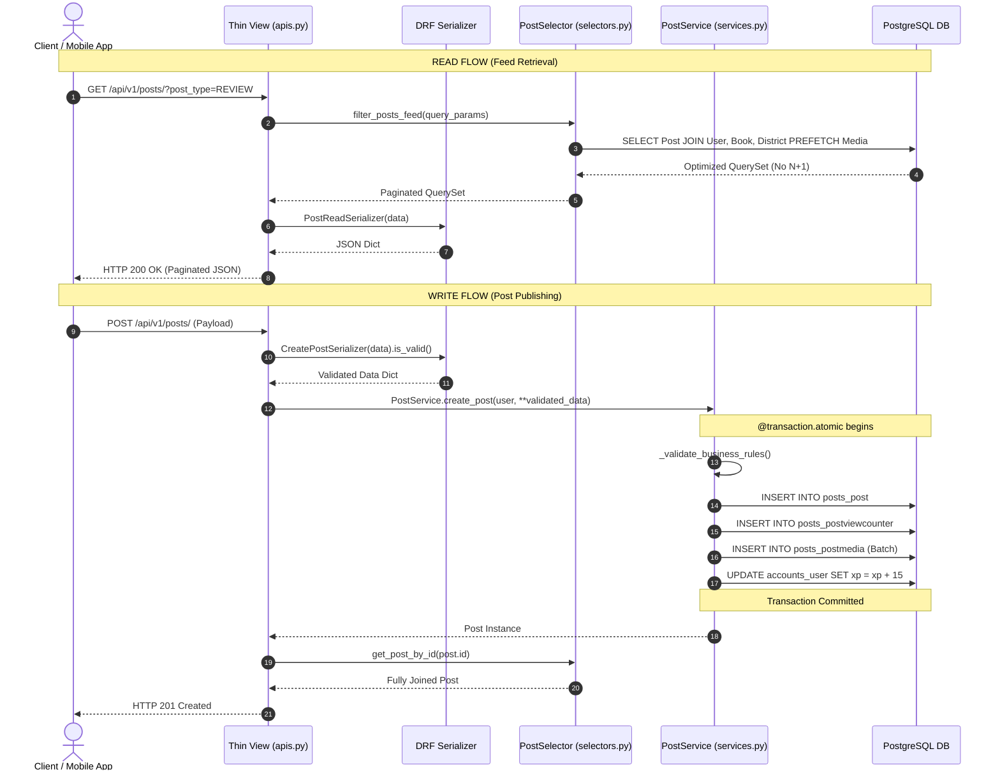
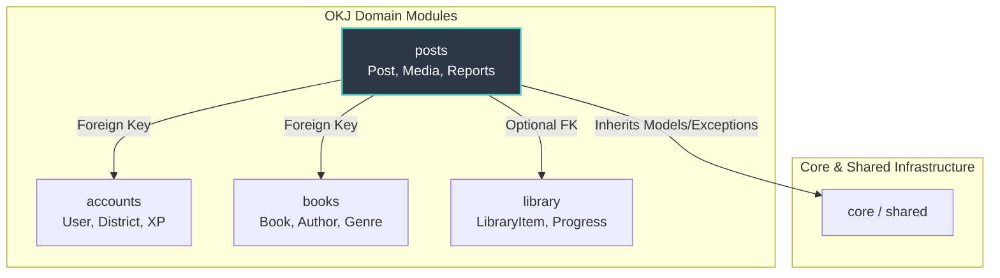

# OKJ Platform — Posts Module Architecture (`apps/posts/`)

This document serves as the comprehensive architectural reference for the **Posts Module**, the core social engine of the **O'zbekiston Kitobxonlari Jamiyati (OKJ)** platform. It explains the structural design, data modeling decisions, query optimization strategies, transactional safety guarantees, and future scaling pathways for upcoming developers.

---

## 1. Domain Overview & Philosophy

The OKJ platform combines the social discovery of **Instagram**, the literary tracking of **Goodreads**, and the community discussions of **Reddit**. Unlike generic content platforms, every piece of content created in OKJ revolves around literature and reader engagement.

To ensure separation of concerns and maintainability across a modular monolith architecture:
- **`posts`** strictly manages content creation, moderation, carousel media, publishing workflows, and unique view tracking.
- Interactive domains (**`likes`**, **`comments`**, **`bookmarks`**, **`follows`**) are decoupled into separate Django applications to allow independent scaling, caching, and business rules.

---

## 2. Models & Data Architecture Rationale

### 2.1 Why Every Model Exists

#### `Post`
- **Purpose**: Represents a unified social feed entry.
- **Why**: Instead of fragmenting the schema into separate tables for quotes, reviews, showcases, and marketplace listings, OKJ uses a **Single Table Inheritance / Polymorphic Discriminator** pattern via `post_type`. This allows single-query pagination across the entire user feed without expensive SQL `UNION` operations across disparate tables.
- **Key Fields**:
  - `post_type`: Distinguishes between `QUOTE`, `REVIEW`, `SHOWCASE`, `EXCHANGE`, `GIFT`, and `SELL`.
  - `status`: Manages lifecycle (`DRAFT`, `PUBLISHED`, `SCHEDULED`, `ARCHIVED`).
  - `moderation_status`: Keeps the community safe (`PENDING`, `APPROVED`, `REJECTED`).
  - `visibility`: Supports reader privacy (`PUBLIC`, `FOLLOWERS_ONLY`, `PRIVATE`).
  - `user_rating` & `quote_text`: Optional domain-specific attributes enforced at the service layer depending on `post_type`.

#### `PostMedia`
- **Purpose**: Stores multiple images per post (Carousel / Album functionality).
- **Why**: An Instagram-style showcase or book exchange listing often requires multiple angles of a book cover or condition. Separating media into a `1-to-Many` table allows an arbitrary number of ordered slides per post without bloating the core `Post` table.

#### `PostReport`
- **Purpose**: Captures community moderation flags and complaints against posts.
- **Why**: Storing reports separately ensures an audit trail for community guidelines enforcement without locking or altering active post rows during user reporting.

#### `DraftPost` (Proxy Model)
- **Purpose**: Provides a dedicated Django model interface and custom manager specifically for unpublished drafts (`status = 'DRAFT'`).
- **Why**: As a Django Proxy Model (`proxy = True`), it shares the exact same database table as `Post` (zero storage overhead) while enabling clean administrative separation in Django Admin and repository-level abstraction in selectors.

#### `PostViewCounter`
- **Purpose**: Maintains high-speed view statistics (total and unique views).
- **Why**: Separating analytics counters from the primary `Post` table prevents row-level contention (`SELECT FOR UPDATE` or high-frequency writes) from locking core content rows during heavy feed read spikes.

---

### 2.2 Why Every Index Exists

```python
indexes = [
    models.Index(fields=["status", "moderation_status", "is_deleted", "-published_at"], name="idx_post_feed"),
    models.Index(fields=["user", "post_type", "-created_at"], name="idx_post_user_type"),
]
```

1. **`idx_post_feed` (`status`, `moderation_status`, `is_deleted`, `-published_at`)**:
   - **Why**: The primary public timeline query filters exactly by `status='PUBLISHED'`, `moderation_status='APPROVED'`, and `is_deleted=False`, ordered chronologically by `published_at DESC`. This composite index allows PostgreSQL to perform an **Index-Only Scan** or **Bitmap Index Scan** directly matching the exact filter conditions in B-Tree sort order, guaranteeing sub-10ms feed queries even with millions of rows.
2. **`idx_post_user_type` (`user`, `post_type`, `-created_at`)**:
   - **Why**: When viewing a reader's profile tab (e.g., "User's Reviews" or "User's Quotes"), queries filter by `user_id` and optional `post_type`. This index immediately locates target rows sorted by creation time.
3. **`slug` (Unique Index)**:
   - **Why**: Enables SEO-friendly public URLs (`/posts/my-favorite-book-review`) with $O(1)$ lookups.

---

### 2.3 Why Every Constraint Exists

1. **Soft Delete (`is_deleted`)**:
   - **Why**: Preserves historical data integrity. If a post is deleted, interactive data (comments, bookmark references) or XP audit trails remain consistent.
2. **Media Ordering Validator (`validate_media_order`)**:
   - **Why**: Ensures image carousels maintain exact sequential order starting from index `0`.
3. **Rating Range Validator (`1 <= user_rating <= 5`)**:
   - **Why**: Prevents invalid review scores from corrupting database averages or UI star components.

---

## 3. Service Layer & Business Rules Rationale

Following the **HackSoft Django Styleguide**, all domain logic resides inside fat services (`services.py`). Views are thin controllers that delegate all operations to services.

### 3.1 Service Methods & Guarantees

#### `PostService.create_post(...)` & `update_post(...)`
- **Enforced Business Rules**:
  1. **Exchange/Sell Requirement**: If `post_type` is `EXCHANGE` or `SELL`, a valid `district_id` must be present to enable local peer-to-peer book swapping.
  2. **Quote Requirement**: If `post_type` is `QUOTE`, `quote_text` cannot be empty.
  3. **Review Requirement**: If `post_type` is `REVIEW`, `user_rating` must be between 1 and 5.
  4. **Showcase Requirement**: If publishing a `SHOWCASE` post, at least 1 `PostMedia` image must be attached.
  5. **30-Minute Media Lock (`check_media_edit_timeframe`)**: Readers can edit or replace post images only within 30 minutes of publishing. After 30 minutes, media mutation is strictly blocked (`HTTP 403`) to prevent bait-and-switch abuse (e.g., changing a verified book review image into spam).
- **Transactional Guarantee**: Decorated with `@transaction.atomic`. Media rows creation, view counter attachment, and XP gamification rewards (15 XP per published post) execute atomically.

---

## 4. Architecture & Request Flow



---

## 5. Module Dependency Graph



---

## 6. Optimization Decisions (Preventing N+1 Queries)

Every read query inside `PostSelector` explicitly defines table joins before serialization:

```python
Post.published_objects.select_related(
    "user", 
    "book", 
    "district", 
    "library_item"
).prefetch_related(
    "media"
)
```
- **`select_related()` (SQL `INNER/LEFT JOIN`)**: Fetches the post's author profile, referenced book catalog entry, location district, and shelf status in a **single database round-trip**.
- **`prefetch_related()` (Separate query in Python memory)**: Fetches all associated carousel images (`PostMedia`) in one secondary query (`SELECT * FROM posts_postmedia WHERE post_id IN (...)`), mapping them in memory instead of issuing $N$ queries for $N$ feed posts.

---

## 7. Future Scaling Plan (10k -> 1M+ Users)

As the OKJ startup grows beyond its initial 10,000–20,000 registered users:

1. **Read-Heavy Caching Layer (Redis)**:
   - Cache serialized public feed pages in Redis (`feed:public:page:1`) with a 60-second TTL or cache-invalidation on new publishing events.
2. **Asynchronous View Counter Aggregation**:
   - Instead of writing to `PostViewCounter` synchronously on every detail GET request, push view increments to a Redis HyperLogLog / stream buffer and flush to PostgreSQL in bulk via background Celery tasks every 5 minutes.
3. **Database Partitioning**:
   - If `posts_post` exceeds 10 million rows, partition the table declaratively by range on `published_at` (e.g., yearly/monthly partitions) to preserve blazing-fast B-Tree index traversal.
